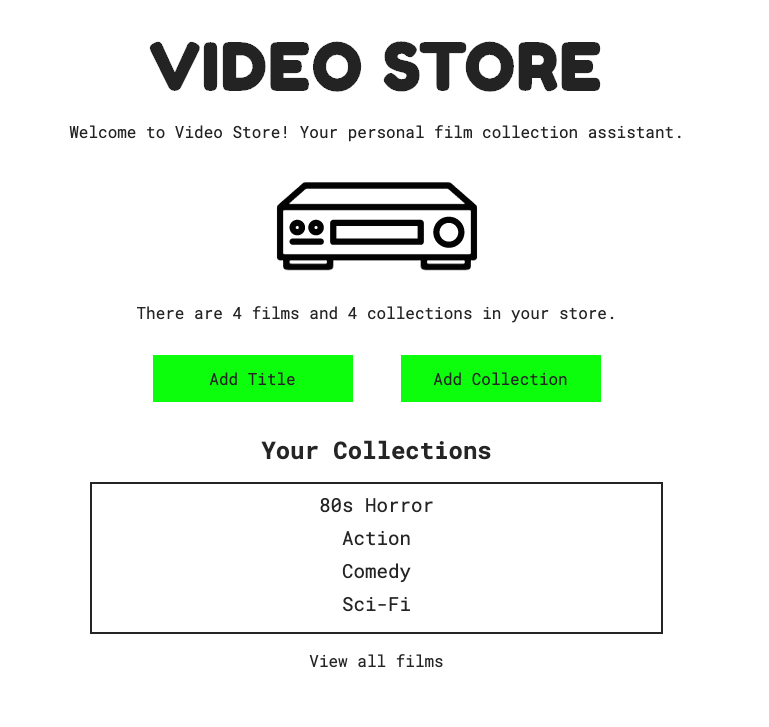

# Video Store

Video Store is an app for managing your personal film collection. Users can add film titles and collections, with any number of films belonging to any number of collections. 
   
    
 Built with film collectors, fans, archivists and sellers/traders in mind.

Try it out! - https://video-store.now.sh/

Users can add any number of films along with optional additional information for each title.

**Title** - Title of the film.   
**Collections** - Which collection(s) the film belongs in. Multiple collections can be selected.    
**Director** - Director(s) of the film.  
**Writers** - Writer(s) of the film script/screenplay.  
**Stars** - Notable/featured actors in the film.  
**Year Released** - Year that film was released.  
**Genre** - Film genre(s).  
**Format** - Format of title (ie. DVD, VHS, digital, etc).      
**Version** - Version of title (ie. Original, Director's Cut, Italian dubbed, bootleg, etc).      
**Condition** - Physical condition of title (useful for selling films).  
**Value** - Value of title (useful for selling films).  
**Rating** - Rating of film on scale of user's choice (ie. 10/10, Five Stars, 2 Thumbs Up, 97).  
**Selling** - Check if marking title for sale.  
**Trailer** - URL input for link to title trailer.  
**Tags** - Custom tags for title (ie. Scary, Funny, Sad).  
**Notes** - Additional notes on film/title.  
**Memorable Scenes** - Memorable scenes from the film.

Users can also create any number of collections with optional notes information for each collection.

## Endpoints

### /films

Shows a list of all films in the user's 'store'.

### /films/1

Shows information entered for the film matching the id of the url param.

### /collections

Shows a list of all collections in the user's 'store'.

### /collections/1

Shows films belonging to the collection with an id matching the url param.

## Technology Used

### Front-end
React with React Router + Context, JS ES6, SCSS

### Back-end
Node.js w/ Express, PostgreSQL, Knex, Postgrator

### Testing
Mocha, Chai, Jest, Supertest

### Deployment
Zeit, Heroku

-----------------

*Paul Baisley 2020*